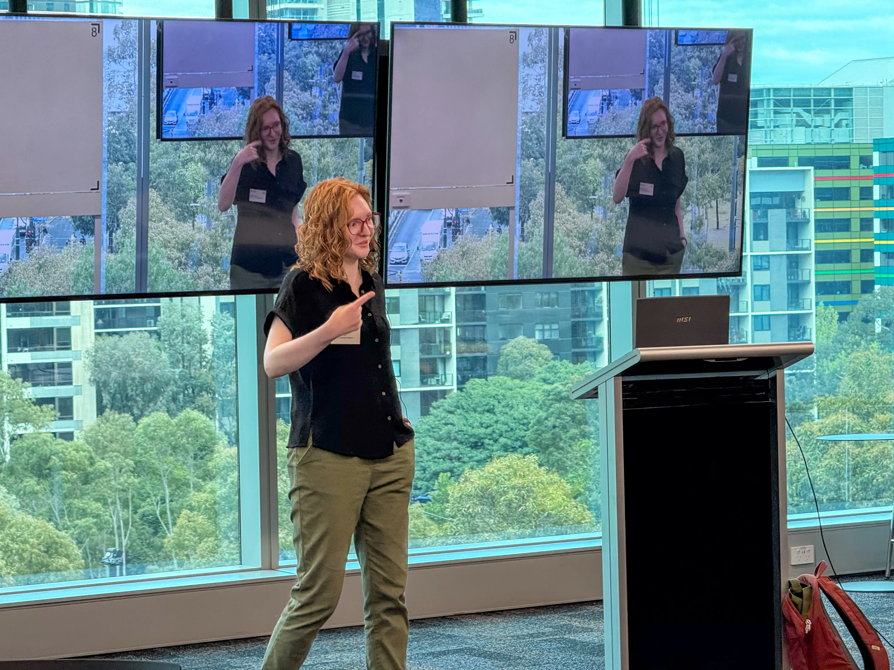
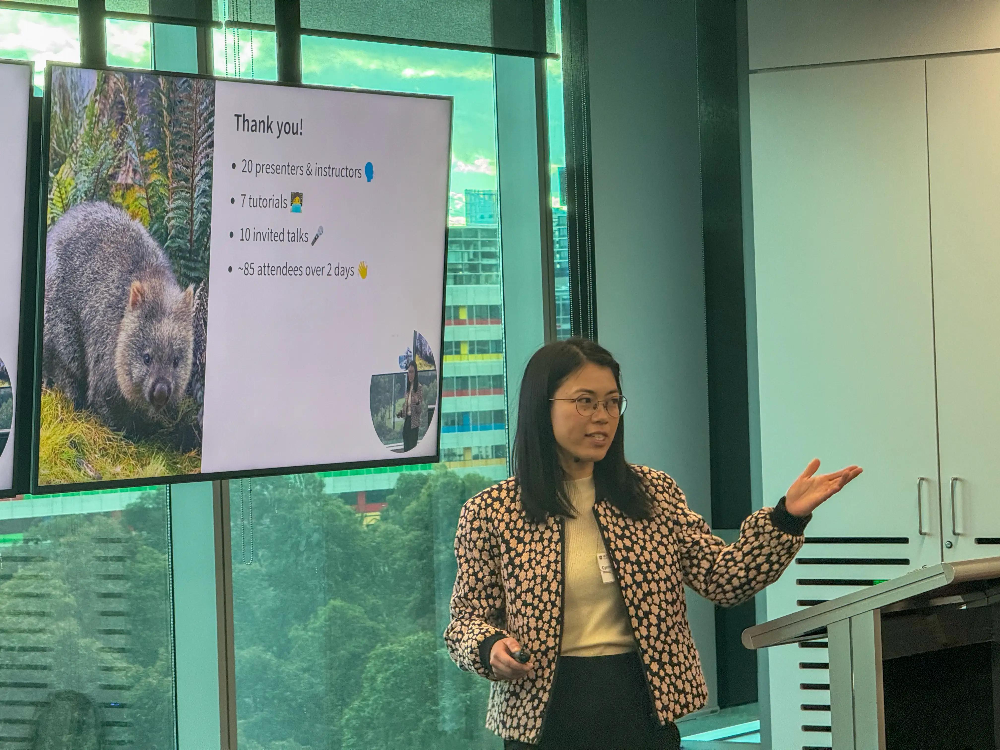
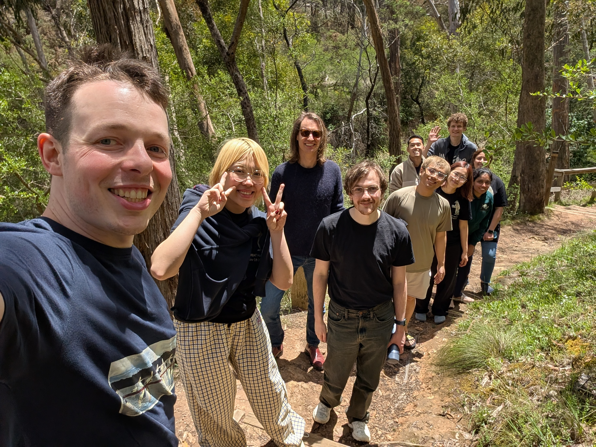
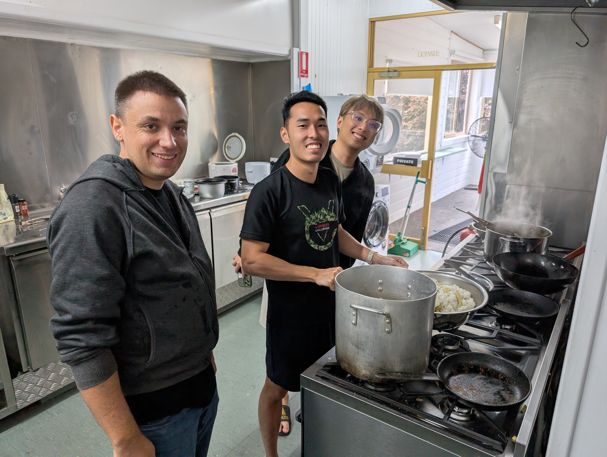
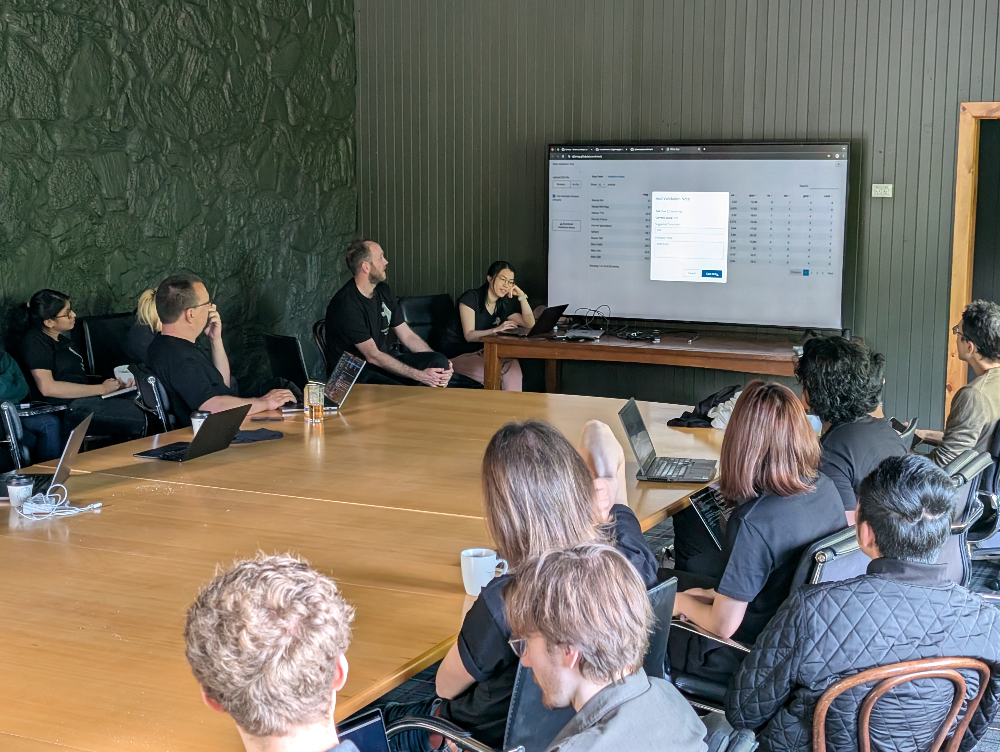
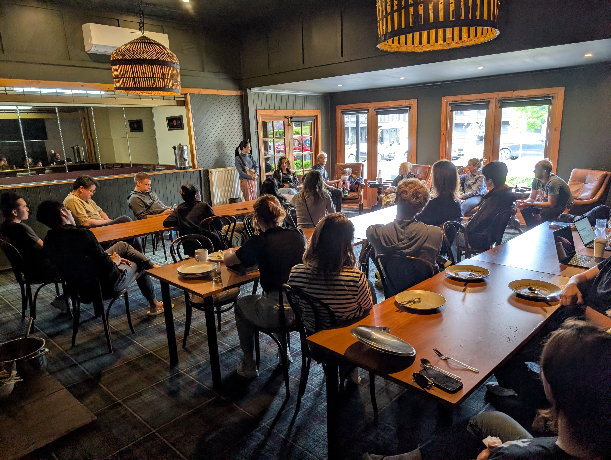
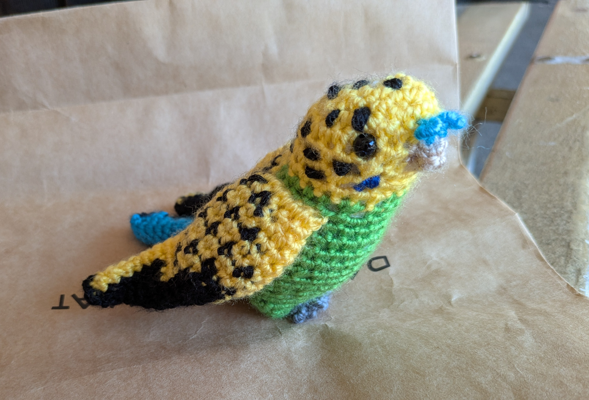
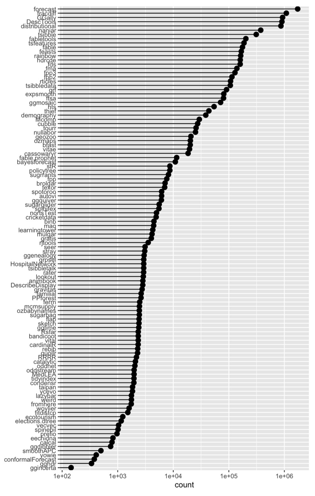

This is a post on various activities that happened in 2025!

## WOMBAT

The [workshop](https://wombat2025.numbat.space) was held Sep 29-30, and featured Nicola Rennie, from the Office for National Statistics in the United Kingdom, as the keynote speaker. Cynthia Huang and Mitch
O’Hara-Wild are the lead organisers, with substantial help from many others, Michael Lydeamore, Hannah Comiskey, Elio Campitelli, Janith Wanniarachchi, Krisanat Anukarnsakulchularp, Maliny Po. There were about 80 attendees from academia, industry and government. Day 1 hosted 8 workshops:

- Introduction to Regression Analysis in R
- Visualising Uncertainty
- Introduction to R packages
- Tidy time series analysis and forecasting
- Efficiency Analysis in Python: A Hands-On Tutorial on Stochastic Frontier Analysis and Data Envelopment Analysis
- Getting Started with C++ for Faster Statistical Modelling in R
- Reproducible Reporting and Research with Quarto
- Building Better Figures: A Scientific Graphic Design Workshop

:::: {.columns}
::: {.column width=33%}

:::
::: {.column width=33%}

:::
::: {.column width=33%}

:::
::::

## Hackathon

The [NUMBATs Hackathon](https://github.com/numbats/numbathackathon/issues) was held Nov 18-20. These are the projects that were developed during these two days:

- [Marking app](https://krisanata.shinyapps.io/marking-app/) integrated with GitHub Classroom
- [Data validation app](https://njtierney.github.io/soundcheck/) for checking data for list of problems
- [Dept network map](https://krisanata.github.io/personal-website/ebs-network.html) showing research connections between faculty and students.
- [Website and links for fresh, local data for teaching](https://numbat.space/data.html) started, and some new datasets added (Australian airline travel, Triple J's Hottest 100, walktober).
- A new R package to conduct block-based bootstrap [blockstrap](https://numbats.github.io/blockstrap/)
- Enhancements to speed up the R package [mcmsupply](https://github.com/hannahcomiskey/mcmsupply/)
- Code to organise into a package to [hide patterns in missing values](https://freierson.github.io/missing-data-pattern-demo/) like the words "Oh no" if explored correctly.
- A new package to automate your CV from ORCID and spreadsheets, [quarto-vitae](https://github.com/quarto-vitae).
- A web site for the new [MBAT Club](https://numbats.github.io/mbats-quarto-website/).
- A new package called [StealLikeBayes](https://bsvars.org/StealLikeBayes) that puts the best code from other sources in a convenient form.

:::: {.columns}
::: {.column width=33%}

:::
::: {.column width=33%}

:::
::: {.column width=33%}

:::
::::

## R Dev Day

[R Dev Day - Australia](https://github.com/r-devel/r-dev-day/issues) (programming base R and help document writing including language translation) was held Nov 21 and had about 40 attendees. Two patches were made available for base R. 

## OceaniaR

[OceaniaR 2025](https://statsocaus.github.io/oceaniar-hack-2025/) was held at ANU, Canberra Nov 23. Three Monash faculty and studens attended. About 30 participants. Several projects developed: autoAlt, ggplot2 battles, refresh of Australia maps and new maps for the Pacific. See the details on the issues page.

## Visitors

– Aug 18-Dec 31 [Natalia Da Silva](https://natydasilva.github.io/natydasilva/), Universidad de la República, Montevideo, Uruguay
– Aug 18-Dec 31 [Ignacio Alvarez (https://nachalca.github.io/nacho-pagina/), Universidad de la República, Montevideo, Uruguay
– Nov 10-21 [Heather Turner](https://github.com/hturner), University of Warwick, UK
– Nov 17-20 [Simon Urbanek](https://urbanek.info), University of Auckland
– Nov 18-20 [Nick Tierney](https://www.njtierney.com), Software Engineer, Credibly Curious

## Secret Santa

The 2025 Secret Santa shared lots of presents, and lots of present steals happening! (Honey, jam, candles, hand-crocheted birds, stuffed toys, pottery, coffee, games, special drinks, pictures, ...)

:::: {.columns}
::: {.column width=60%}

:::
::: {.column width=40%}

:::
::::

## R packages

The group contributed a lot of code to R this year:

- 109 R packages on CRAN authored by current faculty and students.
- 8,920,064 combined downloads this year, just from the Posit mirror.
- 9 new packages in 2025

{width="50%"}
